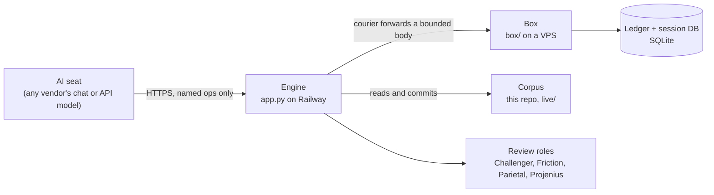

# Ontinuity

Ontinuity is a harness that makes AI work reliable without trusting the model doing it. It gives whatever AI sits in the seat four things it does not have on its own:

- **Memory.** The record lives in the system, not in the model. A fresh AI session, from any vendor, boots from the corpus and resumes work it did not do.
- **Verification.** What "done" means is written down before the work starts. A reviewer from a different model lineage challenges the work, and a deterministic gate refuses to close until the output matches the contract.
- **Record.** Every action an AI takes is a row in a ledger. No AI certifies its own work, and the seat that deploys code is never the seat that wrote it.
- **Independence.** Reliability is supplied by the harness, so the model is replaceable. Models from three vendors have held seats under the same gates, and retired provider models have been swapped without losing work.

The site is the readable front door: [ontinuity.org](https://ontinuity.org), and the one-page argument is [Reliability Without Trust](https://ontinuity.org/reliability.html).

## How it is put together

One install is one engine, one box, and one corpus repository, all owned by the operator.

- **The seat** is an AI in a conversation. It has no shell on the system. It reaches it only through named, bounded operations (the courier allowlist), each of which is logged at both ends.
- **The engine** (`app.py`) runs the adversarial session loop, relays seat operations to the box, and reads and writes the corpus.
- **The box** (`box/`) holds the database, the mailbox seats use to hand work to each other, and the two gates.
- **The corpus** (`live/`) is the system's memory: the manual, the rules, the work order, and the full record of what was decided and why.

Two gates bracket every working session:

1. **Bootstrap gate** (`box/gate.py`). Seven checks before a seat may act: the manual matches the live operation list, the last handoff is readable, the corpus is reachable, the seat's hands work, the engine is idle, the seat can state the operating rules correctly, and every review role is alive. Passing opens a seat session and issues a per-identity key.
2. **Close gate** (`box/close_gate.py`). Among its checks, the session's contract is reconciled item by item. Work items close on evidence (a commit or a ledger row inside the session's window); judgment items close on the operator's recorded ruling. An open or unevidenced item blocks the close.

## Where to look

| If you want | Go to |
|---|---|
| The rules every seat works under | `live/THE_PARADIGM.md`, `live/OPERATING_RUBRIC.md` |
| How the system is operated | `live/OPERATING_MANUAL.md` |
| What a new AI is given to boot | `live/CONTROL_QUICKBOOT.md` |
| The current work order | `live/PUNCH_LIST.md`, `live/CONTROL_HANDOFF.md` |
| The record of decisions, including reversals and failures | `live/agent_queue.md`, `live/conversations/` |
| A map of every part and its status | `live/ONTINUITY_MASTER_SYSTEM_MAP.md` |
| Designs, built and unbuilt | `live/specs/` (most of this folder is a proposal backlog, not shipped features) |
| The memory discipline with no install at all | `project-corpus-standard/` |
| Retired code and prompts, kept for history | `museum/` |
| The foundational papers | `papers/`, or [ontinuity.org/papers.html](https://ontinuity.org/papers.html) |

The ledger itself (`operations_ledger`, `seat_sessions`, `seat_contracts`) lives in the box's database, not in this repo. On a running install, `GET {engine}/agent/handoff` returns the receipt: open seat sessions, each contract item with its status and evidence, and the last close.

## Standing up an install

An install is a private corpus repo, the engine deployed from this repo, and the `box/` package on a small VPS. A second install has been stood up this way from a written runbook on fresh cloud services, and a new AI seat booted into it through the seven-check gate. The runbook sits in a private repository because it carries account-specific steps; the code it installs is all here.

## Status

Working, and run by its author on two installs. The gates above are live on both. The next step in the work order is a model from a different vendor booting the second install from the packet alone, then the first outside user.

Plainly: this is a solo project. The code is written with AI and reviewed by a second model of a different lineage before it deploys; it has not had a human code review. There is no paying user yet. The record in `live/` includes the system's failures and the author's mistakes, on purpose. A record that hides them could not be checked.

## License

The software is licensed under the GNU AGPL-3.0 (see `LICENSE`). The papers, the site content, and the name are reserved (see `NOTICE`). Commercial licensing is available from the author.

Patrick Killebrew · killebrewpatrick@gmail.com
